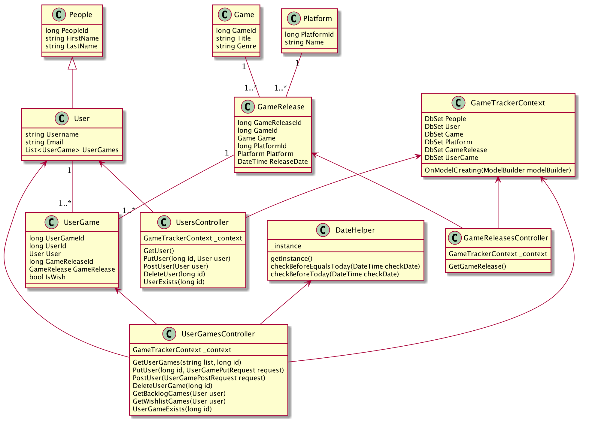

# GameTracker
C# ASP .Net Core Projekt für Prog4

Dieses Projekt bietet seinen Benutzer die Möglichkeit Spiele zu einer Tracking List hinzuzufügen. Hierbei gibt es aktuell 2 verschiedene Listen:
* Backlog: Spiele in dieser Liste werden aktuell gerade von dem Benutzer gespielt
* Wishlist: Diese Liste repräsentiert eine Wunschliste von Spielen die der Benutzer gerne in Zukunft spielen möchte.
Mit diesem Projekt können sich Benutzer beim Server registrieren und da

Jedes Spiel kann 0..* Releases haben. Ein Release referenziert sich immer auf ein Spiel und eine
spezifische Plattform. So kann das Spiel Darksiders 3 ein Release für Xbox und eines für PS4 haben zum Beispiel. 
Jedes Release hat außerdem ein Releasedatum. Ein Benutzer kann ein Spiel nicht zu seinem
Backlog hinzufügen wenn das Releasedatum nach dem heutigen Datum liegt. 

Die Spielelisten können vom Server abgefragt werden und Spielereleases können zu den 
Listen hinzugefügt werden.

Benutzer können sich beim Server registrieren, ihre Daten ändern und auch ihr Benutzer wieder
löschen.

Die Spiele, Platformen und Releases werden beim anlegen der Datenbank generiert.
Und kann somit nicht über die API gemacht werden.

## Building
Im GameTracker Projekt Ordner die folgenden Befehle ausführen:
```
docker-compose build
docker-compose up
```

## OpenApi Contract
Die Beschreibung der REST Api Endpoints ist in dem [GameTrackerContract.yaml](http://github.com) File zu finden.
Für eine graphishe Darstellung kann der Inhalt einfach in den Swagger Editor kopiert werden (http://editor.swagger.io/).

## Klassendiagramm
